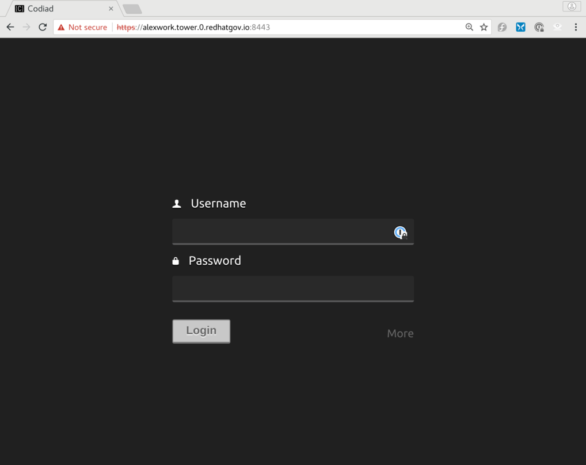

# Ansible Tower Workshop


`Ansible_Tower_Workshop` is a ansible playbook to provision Ansible Tower in AWS. This playbook uses Ansible to wrap Terraform, for provisioning AWS infrastructure and nodes. To find more info about Terraform [check here](https://www.terraform.io/docs/providers/aws/index.html)

These modules all require that you have AWS API keys available to use to provision AWS resources. You also need to have IAM permissions set to allow you to create resources within AWS. There are several methods for setting up you AWS environment on you local machine.

Fill out `env.sh` & Export the AWS API Keys

First, copy env.sh_example to env.sh, and then fill in your API keys.  Once that is complete, source the script, to export your AWS environment variables.

```
source env.sh
```

This repo also requires that you have Ansible installed on your local machine. For the most upto date methods of installing Ansible for your operating system [check here](http://docs.ansible.com/ansible/intro_installation.html).

This repo also requires that Terraform be installed if you are using the aws.infra.terraform role. For the most upto data methods of installing Terraform for your operating system [check here](https://www.terraform.io/downloads.html).


## AWS Infrastructure Roles


### roles/aws.infra.terraform

To create infrastructure and a Ansible Tower instance via Terraform:

#### OS X
```
sudo easy_install pip
sudo pip install boto
sudo pip install ansible
sudo pip install passlib
/usr/bin/ruby -e "$(curl -fsSL https://raw.githubusercontent.com/Homebrew/install/master/install)"
brew install terraform
```

#### RHEL/CentOS
```
sudo yum install https://dl.fedoraproject.org/pub/epel/epel-release-latest-7.noarch.rpm
# server
subscription-manager repos --enable="rhel-7-server-rpms" --enable="rhel-7-server-extras-rpms" --enable="rhel-7-server-optional-rpms"
# workstation
subscription-manager repos --enable="rhel-7-workstation-rpms" --enable="rhel-7-workstation-extras-rpms" --enable="rhel-7-workstation-optional-rpms"
sudo yum -y install python2-boto ansible
wget https://releases.hashicorp.com/terraform/0.9.11/terraform_0.9.11_linux_amd64.zip # current release as of this date...check to see if a newer version is availabke
sudo unzip terraform_0.9.11_linux_amd64.zip -d /usr/local/bin terraform
```

#### Fedora 25/26
```
sudo dnf -y install python2-boto ansible
wget https://releases.hashicorp.com/terraform/0.9.11/terraform_0.9.11_linux_amd64.zip # current release as of this date...check to see if a newer version is availabke
sudo unzip terraform_0.9.11_linux_amd64.zip -d /usr/local/bin terraform
```
# Custom Variable Requirements
* Copy `group_vars/all_example` to `group_vars/all.yml`
* Fill in the vars with your AWS api info. This role can also provide easy domain name mapping to all the instances if you have a domain registered in AWS Route 53.  You can get the zone ID from the DNS domain stored in Route 53.


```
#####################################################
# Domain Name you own
#####################################################
domain_name: ""
zone_id: ""

#####################################################
# AWS API Keys for terraform.tfvars file
#####################################################
aws_access_key: ""
aws_secret_key: ""
```
* Define the workshop prefix.  Use a name/word that reflects the workshop you are teaching. **NOTE: No special characters**
##### Example:
```
workshop_prefix:                  "NYCworkshop"
```
* Uncomment the `ami_id` you wish to use for the AWS instance
##### Example:
```
ami_id:                         "ami-a4791ede" # RHEL 7.4 with JBoss EAP 7.1
```

* Define variables to allow enable subscription with RHSM

**IMPORTANT!:**
For the Maven/JBoss steps in Exercise 1.0 to work, you must have a JBoss-enabled Cloud Access AMI, or you must disable Cloud Access, and use a traditional subscription, as shown below.  It is recommended that you enable Cloud Access and NOT use a traditional subscription as there is a known/unresolved bug when connecting to Red Hat servers.  

**NOTE: If following this recommendation, your variables will look like this:**

```
# subscription_manager     |      Red Hat Subscription via Cloud Access
cloud_access:                     true
# subscription_manager     |      Red Hat Subscription via activation key and org id
rhsm_activationkey:               ""
rhsm_org_id:                      ""
# subscription_manager     |      Red Hat Subscription via username & password
username:                         ""
password:                         ""
pool_id:                          ""
```
**NOTE: If you choose the traditional RHSM route, your variables will look something like this**

Red Hat Subscription Manager uses **_either_** an `activation key / org id` combination or a `username/password` combination, not both.
```
# subscription_manager     |      Red Hat Subscription via Cloud Access
cloud_access:                     false
# subscription_manager     |      Red Hat Subscription via activation key and org id
rhsm_activationkey:               "myactkey"
rhsm_org_id:                      "12345678"
# subscription_manager     |      Red Hat Subscription via username & password
username:                         "user@company.com"
password:                         "my_password"
pool_id:                          "1234567890abcdef01234567890abcde"
```

#### Provision Workshop Nodes

```
ansible-playbook 1_provision.yml  
```
#### Install packages and configure the newly provisioned nodes.

**NOTE: You need to run this playbook with sudo priviledges which are provided via the -K option. DO NOT add 'sudo' to this command.**
```
ansible-playbook 2_load.yml -K
```

#### To destroy the workshop environment

```
ansible-playbook 3_unregister.yml
rm -rf .redhatgov
```

## Login to the primary workshop node

Browse to the URL of the EC2 instance and enter the `ec2-user`'s password `workshop_password:` located in `group_vars/all`.

```
https://{{ workshop_prefix }}.tower.0.{{ domain_name }}:8888/wetty/ssh/ec2-user
```

There is a web-based IDE running on port 8443 of each tower node.  That IDE can be used to edit Ansible playbooks, rather than using a command line editor, like `vim` or `nano`.



## Walkthrough for Scripts

A walkthrough for most of the typewritten steps has been added to the workshop, both to speed up workshops presented within a limited schedule, or to help a studenmt who has made a mistake, or who has fallen far behind.

The walkthrough is deployed on the tower nodes, in `~ec2-user/walkthrough`.
