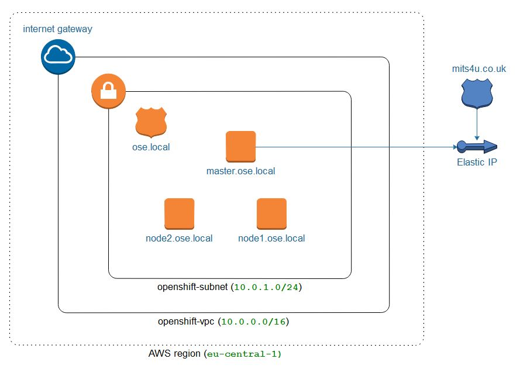

# OpenShift AWS Setup

This is an Ansible automation playbook that provisions a small OpenShift environment (1 master, x app nodes) that is suitable for demos and small POCs.

The playbook can deploy either Origin or Container Platform.

## Prerequisites

### Ansible by Red Hat

1. This project is only supported with the [Ansible][0] version >=2.4

### Amazon Web Services

1. Create an [AWS account][1] with privileges to a `route53` registered domain
2. Make sure to setup [AWS Command Line Interface for use when interacting with AWS][2].

## Configuration

AWS related configuration can be customized by modifying `group_vars/all/vars.yaml`, and the number of default application nodes is three.

By default a single admin user is created that can be used to login into the web console. The username/password is set in the `group_vars/all/vault` file. Other users can be added to this file as well.

The OpenShift inventory can be customized by modifying `roles/openshift-install/files/openshift_inventory.cfg`, where dynamic metrics and logging is enabled by default as well as the AWS cloud provider.

#### Container Native Storage (CNS) Gluster

The playbook can optionally install CNS storage (gluster) as the default persistent storage provider for application storage. This will provision an additional three nodes dedicated to CNS. To use this feature, set the `install_gluster` to true and configure other parameters as needed.

**Note this is only for application storage, the registry remains on AWS storage.**

#### Master and User Pods

By default, the master will not host user pods, just infra pods. If you want the master to host user pods, comment the `osm_default_node_selector` in `roles/openshift-install/files/openshft_inventory.cfg`.

**Note that if you also install gluster, this will cause the gluster nodes to host user pods as well.**

This is currently disabled since there is a bug using osm_default_node_selector with gluster install, if you want the master to be unencumbered with user pods please uncomment this line in inventory.cfg. Also, you cannot install gluster and have `osm_default_node_selector` enabled at the same time currently.

## Usage

Set shell session variables `AWS_ACCESS_KEY_ID` and `AWS_SECRET_ACCESS_KEY` prior to running playbooks below.

```sh
source setup.sh.example
```

Optionally, to encrypt the `group_vars/all/vars.yml` vault parameters, you must set the `vault_password_file` parameter within `ansible.cfg`. Afterwards, you can encrypt/decrypt the vault file, like so:

```sh
# Encrypt vault variables
ansible-vault encrypt group_vars/all/vault

# Decrypt vault variables
ansible-vault decrypt group_vars/all/vault
```

See documentation for further information on [Ansible Vault][10].

### Provision Amazon Web Services EC2 Infrastructure

```sh
ansible-playbook -vvv provision.yml
```

### Deploy Red Hat OpenShift Container Platform

```sh
ansible-playbook -vvv playbook.yml
```

### Configure Red Hat OpenShift Container Platform

```sh
ansible-playbook -vvv configure.yml
```

### Delete Red Hat OpenShift Container Platform

```sh
ansible-playbook -vvv destroy.yml
```

## Network Topology



A private VPC and DNS is used, OpenShift is installed using the private IP addresses. This means the IP addresses never change, unlike EC2 public addresses, and the environment can be stopped and started as needed.

A bastion is created as part of the installation, however once the installation is complete it is no longer needed and may be stopped or terminated. Note that it can be handy to keep the bastion around in a stopped state in case you want to manually re-run the installation again.

## Troubleshooting

If the OpenShift installation fails at task `run openshift installation script`, you can ssh to the bastion and review the `openshift-install.log` file to see what issue occurred.

Cockpit is available on port 9090 so you can access it using the same URL as the master but change 8443 to 9090\. If you set an OpenShift admin user Cockpit will be configured to use the same username/password.

## Credits

Originally inspired by Gerald Nunn's [openshift-aws-setup][7] project. Thanks!

[0]: https://www.ansible.com/
[1]: https://aws.amazon.com/
[2]: https://docs.aws.amazon.com/cli/latest/userguide/cli-chap-getting-started.html
[3]: https://pypi.python.org/pypi/virtualenv
[4]: http://docs.aws.amazon.com/cli/latest/userguide/cli-environment.html
[5]: https://www.redhat.com/en/about/value-of-subscription
[6]: https://access.redhat.com/articles/1378093
[7]: https://github.com/gnunn1/openshift-aws-setup
[8]: http://docs.ansible.com/ansible/latest/playbooks_vault.html
[9]: http://docs.ansible.com/ansible/intro_installation.html
[10]: https://docs.ansible.com/ansible/2.4/vault.html
